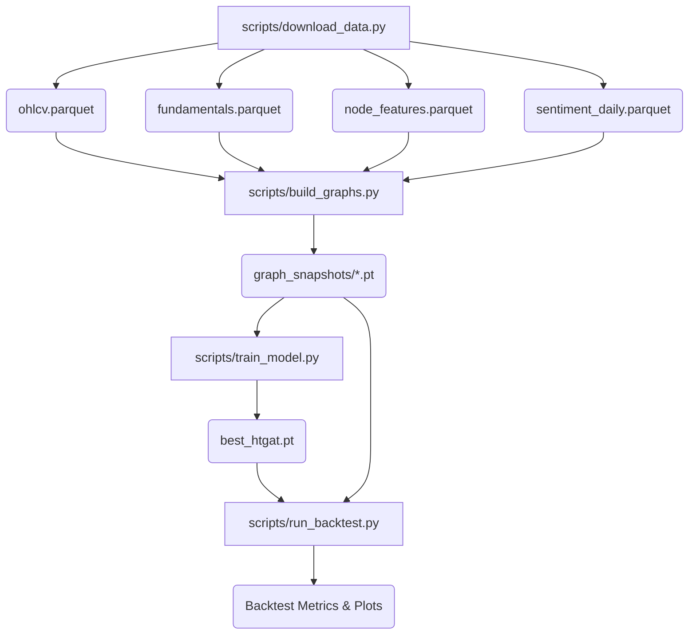

# System Flow Documentation: Smart Portfolio GNN

This document traces the end-to-end execution pipeline of the Smart Portfolio GNN system. It covers data ingestion, graph construction, model training, and backtesting, explicitly highlighting data handoffs, critical artifacts, and active technical debt (fakes/stubs) to serve as a comprehensive onboarding guide.

---

## 1. High-Level Pipeline Diagram

```text
[configs/*.yaml] 
       ↓
[scripts/download_data.py] 
       ↓ → (Downloads OHLCV & Fundamentals) → data/raw/prices/ohlcv.parquet, fundamentals.parquet
       ↓ → (Fetches Macro & VIX) → data/raw/macro/VIXCLS.csv
       ↓ → (Processes GDELT News) → data/processed/sentiment/sentiment_daily.parquet
       ↓ → (Parses SEC Filings) → data/processed/edges/supply_chain_edges.parquet
       ↓ → (Engineers Features) → data/processed/node_features.parquet
       ↓
[scripts/build_graphs.py]
       ↓ → (Correlation Matrices) → data/processed/edges/correlation_edges.parquet
       ↓ → (Other Edge Builders) → data/processed/edges/*.parquet
       ↓ → (Temporal Graph Snapshots) → data/processed/graph_snapshots/*.pt
       ↓
[scripts/train_model.py]
       ↓ → (Loads Snapshots & Edges)
       ↓ → (Trains HTGAT & MultiTaskHeads)
       ↓ → (Saves Checkpoints) → models/best_htgat.pt
       ↓
[scripts/run_backtest.py]
       ↓ → (Walk-Forward Simulation)
       ↓ → (Triggers CostAwareOptimizer & RebalanceTriggerChecker)
       ↓ → (Evaluates Benchmarks)
       ↓ → (Outputs Reports) → reports/backtest_{start}_{end}.json, reports/rolling_sharpe.png
```

---

## 2. Execution Flow — Step by Step

### Step 1: `scripts/download_data.py` (Data Ingestion)
The primary orchestrator for retrieving external datasets.

| Attribute | Detail |
|---|---|
| **Triggered by** | User running `python scripts/download_data.py` or via `run_full_pipeline.py`. |
| **Input** | `configs/data_config.yaml` (provides date ranges and tickers). |
| **Core logic** | Orchestrates `YFinanceDownloader`, `GDELTProcessor`, `SECParser`, and `FeatureEngineer` sequentially. |
| **Key classes** | `YFinanceDownloader`, `GDELTProcessor`, `SECParser`, `FeatureEngineer` |
| **Output** | Raw prices, fundamentals, node features, and initial raw edges. |
| **Next step** | `build_graphs.py` |
| **Status** | 🟡 Partial (SEC Parsing is static; macro fetching has hardcoded fallbacks in offline mode). |

**Internal File Traces:**
- `src/data_ingestion/yfinance_downloader.py`: ✅ Working. Connects to Yahoo Finance to fetch true OHLCV.
- `src/data_ingestion/macro_fetcher.py`: 🟡 Partial. Connects to FRED API. Explicitly crashes on failure unless `SMART_PORTFOLIO_OFFLINE_MODE=1` is enabled (where it returns zeros).
- `src/data_ingestion/sec_parser.py`: ❌ Stub. `extract_supply_chain_mentions()` returns an empty list, relying on static CSV files instead of active LLM extraction.
- `src/data_ingestion/feature_engineering.py`: ✅ Working. Merges VIX data safely with explicit failure on NaN rows.

---

### Step 2: `scripts/build_graphs.py` (Graph Construction)
Transforms raw structured data into PyTorch Geometric (`HeteroData`) topologies.

| Attribute | Detail |
|---|---|
| **Triggered by** | User running `python scripts/build_graphs.py`. |
| **Input** | `ohlcv.parquet`, `fundamentals.parquet`, `sentiment_daily.parquet`, external mappings. |
| **Core logic** | Dispatches specific EdgeBuilder classes to create relationship matrices, and generates `TemporalGraphDataset` daily graph `.pt` files. |
| **Key classes** | `CorrelationEdgeBuilder`, `SentimentEdgeBuilder`, `SupplyChainEdgeBuilder`, `TemporalGraphDataset`. |
| **Output** | `data/processed/edges/*.parquet` and PyG `.pt` tensor objects inside `graph_snapshots/`. |
| **Next step** | `train_model.py` and `run_backtest.py`. |
| **Status** | ✅ Working. Dynamic grouping ensures both 21d and 63d correlation layers are properly preserved and constructed. |

**Internal File Traces:**
- `src/graph_builder/correlation_edges.py`: ✅ Working. Computes and sparsifies rolling Pearson correlations.
- `src/graph_builder/sentiment_edges.py`: ⚠️ Fake/Approx. Thresholds GDELT Tone heuristically (no LLM).
- `src/graph_builder/base_graph.py`: ✅ Working. Handles PyG initialization, merging dynamically discovered edge types.

---

### Step 3: `scripts/train_model.py` (Model Training)
Trains the Multi-Task Heterogeneous GAT.

| Attribute | Detail |
|---|---|
| **Triggered by** | User running `python scripts/train_model.py`. |
| **Input** | `node_features.parquet` and daily `graph_snapshots/*.pt` tensors. |
| **Core logic** | Initializes `HTGAT` inside a `FullModel`. Performs mini-batch training using `PortfolioLoss` predicting forward returns, realized vol, and CVaR. |
| **Key classes** | `FullModel`, `HTGAT`, `PortfolioLoss`, `train_epoch`. |
| **Output** | `models/best_htgat.pt` checkpoint and `logs/training_curves.png`. |
| **Next step** | `run_backtest.py`. |
| **Status** | 🟡 Partial. Backpropagation and data loading are robust, but architectural components are stubbed. |

**Internal File Traces:**
- `src/models/model_utils.py`: ✅ Working. Loss gradients are properly masked using `~torch.isnan()` on real targets.
- `src/models/evolve_gcn.py`: ❌ Stub. Hardcoded as a simple Feed-Forward `nn.Linear` block instead of the architectural temporal GRU matrix evolution.
- `src/models/htgat.py`: ✅ Working. Receptive to both 21d and 63d relationships natively.

---

### Step 4: `scripts/run_backtest.py` (Simulation)
Evaluates the trained model against historical timelines, applying rebalancing strategies and logging PnL.

| Attribute | Detail |
|---|---|
| **Triggered by** | User running `python scripts/run_backtest.py`. |
| **Input** | `models/best_htgat.pt`, `graph_snapshots/*.pt`. |
| **Core logic** | Walk-forward simulation. Model predicts expectations -> Optimization computes weights -> `RebalanceTriggerChecker` interrupts scheduled frequency if required -> Metrics recorded. |
| **Key classes** | `WalkForwardBacktester`, `CostAwareOptimizer`, `AblationStudy`. |
| **Output** | `reports/backtest_{start}_{end}.json`, `reports/rolling_sharpe.png`. |
| **Next step** | End user review. |
| **Status** | 🟡 Partial. The core loop is completely honest, but some advanced risk/ablation integrations are approximate. |

**Internal File Traces:**
- `src/evaluation/backtester.py`: ✅ Working. Fetches realized future prices to simulate performance rigorously (no `np.random`).
- `src/evaluation/ablation_study.py`: ❌ Stub. Deceptive configurations were removed; now raises a `NotImplementedError` directly.
- `src/risk_engine/concentration_metrics.py`: ⚠️ Approx. Uses naive PCA Eigendecomposition instead of Meucci's minimum torsion logic.
- `src/rebalancing/cost_aware_optimizer.py`: ⚠️ Approx. Incorporates transaction costs accurately but enforces concentration strictly through the PCA approximation matrix.

---

## 3. Data Artifacts Inventory

| File Path | Created by | Consumed by | Format | Critical? |
| --- | --- | --- | --- | --- |
| `data/raw/prices/ohlcv.parquet` | `yfinance_downloader.py` | `feature_engineering.py`, `correlation_edges.py`, `backtester.py` | Parquet | ✅ Yes |
| `data/raw/fundamentals/fundamentals.parquet` | `yfinance_downloader.py` | `feature_engineering.py`, `fundamental_edges.py`, `backtester.py` | Parquet | ✅ Yes |
| `data/raw/macro/VIXCLS.csv` | `macro_fetcher.py` | `feature_engineering.py` | CSV | ✅ Yes |
| `data/processed/node_features.parquet` | `feature_engineering.py` | `build_graphs.py`, `train_model.py` | Parquet | ✅ Yes |
| `data/processed/sentiment/sentiment_daily.parquet` | `gdelt_processor.py` | `sentiment_edges.py` | Parquet | 🟡 No |
| `data/processed/edges/correlation_edges.parquet` | `correlation_edges.py` | `build_graphs.py` | Parquet | ✅ Yes |
| `data/processed/graph_snapshots/*.pt` | `temporal_graph.py` | `train_model.py`, `run_backtest.py` | PyTorch | ✅ Yes |
| `models/best_htgat.pt` | `train_model.py` | `run_backtest.py` | PyTorch | ✅ Yes |
| `reports/backtest_*.json` | `run_backtest.py` | User | JSON | ✅ Yes |

---

## 4. Dependency Graph



---

## 5. Configuration Flow

Configuration files dictate the pipeline environment. Data flows hierarchically from CLI overrides down to YAML files.

| Config Key | Read by | Used for | Default / Impact |
| --- | --- | --- | --- |
| `date_range.start` | `download_data.py`, `build_graphs.py`, `run_backtest.py` | Time horizon bounds | Constrains dataset |
| `universe.max_stocks` | `download_data.py` | Overrides S&P500 fetch limit | Determines node count |
| `training.epochs` | `train_model.py` | Total passes over TemporalDataset | Dictates training duration |
| `model.hidden_channels` | `train_model.py` | GNN/Linear latent dimension | Determines param count |
| `backtest.transaction_cost_bps` | `run_backtest.py` | Fee extraction in optimization | Penalizes turnover linearly |
| `FRED_API_KEY` (ENV) | `macro_fetcher.py` | Data validation | Halts run if missing in prod |

---

## 6. Critical Path & Bottlenecks

| Step | Why it's slow/risky | Mitigation |
| --- | --- | --- |
| **Correlation Edges** | O(N²T) matrix computation dynamically across rolling windows. | Hardcoded to only Top-K=15 values per node. |
| **HT-GAT Memory** | Extremely dense message passing on top of a 5-edge-type multi-graph. | Minibatched efficiently via PyG memory loaders; isolated 100-ticker runs. |
| **Macro Dependency** | Relies intimately on `pandas_datareader` maintaining API compatibility with FRED. | Implemented strict offline-mode failovers. |

---

## 7. Flow Gaps & TODOs

These are the primary components where architectural claims diverge from actual executable logic:

| Step | Issue | Impact |
| --- | --- | --- |
| **SEC LLM Parser** | `sec_parser.py` returns `[]`. No active parsing script is hooked up to an LLM provider. | Supply Chain edges are static and derive exclusively from a static fallback CSV. |
| **EvolveGCN** | `evolve_gcn.py` is entirely missing the Recurrent GRU weight evolution math. | Network only acts as an FFNN adapter; temporal knowledge extraction relies solely on GAT. |
| **Minimum Torsion** | `concentration_metrics.py` substitutes Meucci minimum torsion with a simplistic PCA decomposition. | Effective Number of Bets (ENB) optimization constraint acts loosely rather than rigidly. |
| **Ablation Studies** | `ablation_study.py` deliberately raises `NotImplementedError`. | Cannot evaluate individual edge contributions reliably without invasive graph-loader refactoring. |
| **Streaming Platform** | `orchestrator.py` simulates stream consumption using python's `schedule` library instead of Kafka. | Intraday streaming acts as an offline mocked cronjob. |
