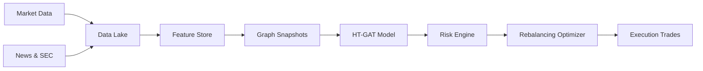
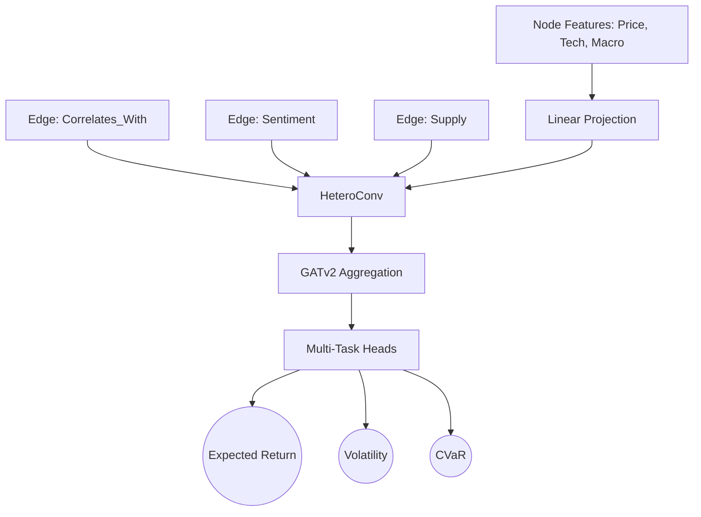
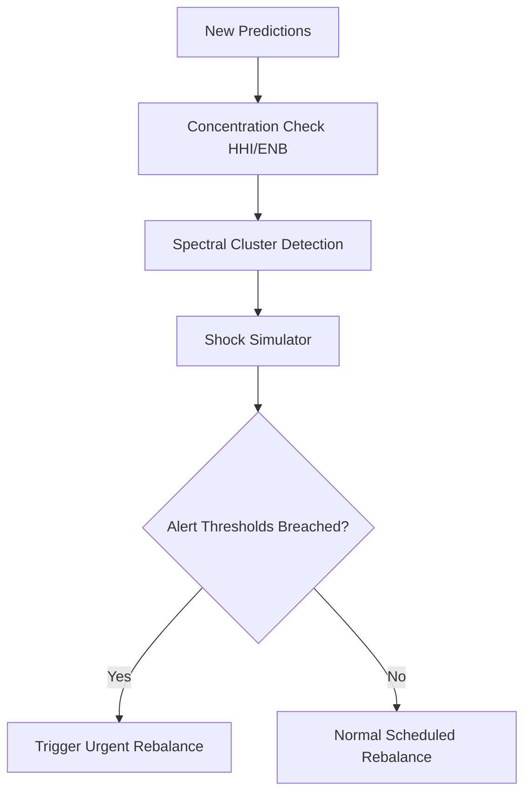

# System Architecture Documentation

The Smart Portfolio GNN project is built on a highly modular 5-layer architecture.

## Layer 0-4 Explanation

### Layer 0: Data Ingestion
Retrieves unstructured and structured data from APIs (yfinance, GDELT, SEC EDGAR). Normalizes timestamps, fills missing values, and saves to raw parquet files.

### Layer 1: Feature Engineering & Graph Construction
Transforms time-series data into predictive features. Constructs a heterogeneous temporal graph with nodes (stocks) and dynamic edges (correlations, sentiment co-mentions, supply chains, sector groupings).

### Layer 2: Predictive Modeling (HT-GAT)
The core intelligence layer. Uses Heterogeneous Temporal Graph Attention Networks to create context-aware node embeddings. Multi-task prediction heads forecast expected returns, volatility, and Conditional Value at Risk (CVaR).

### Layer 3: Risk Engine & Optimization
Simulates macroeconomic shocks over the graph structure. Analyzes spectral clustering to detect hidden portfolio concentration. Solves a constrained convex optimization problem (incorporating transaction costs) to generate final portfolio weights.

### Layer 4: Real-time Streaming & Visualization
A Kafka-backed daemon polls for incoming ticks, performing sub-second incremental graph updates. A Streamlit dashboard visualizes portfolio health, network topologies, and alerts.

## Data Flow Diagram

## Model Architecture (HT-GAT)

## Risk Engine Flowchart

## Technology Stack

| Layer | Technologies |
| :--- | :--- |
| **Data Processing** | Pandas, NumPy, yfinance, Parquet |
| **Graph Construction** | PyTorch Geometric (PyG), NetworkX |
| **Deep Learning** | PyTorch |
| **Optimization** | SciPy, cvxpy (optional) |
| **Streaming** | Kafka, Watchdog |
| **Dashboard** | Streamlit, Plotly |
| **DevOps** | Docker, GitHub Actions, Pytest |
