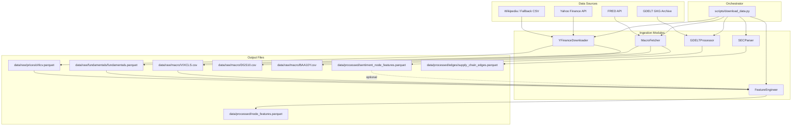

# Data Ingestion Pipeline

The data ingestion pipeline downloads, processes, and engineers features from multiple financial data sources to produce graph-ready node features for the GNN portfolio optimization model.

---

## Architecture Overview



---

## Pipeline Execution Order

The orchestrator (`scripts/download_data.py`) runs 6 stages in sequence:

| Step | Module | What it does | Time (3 tickers) |
|------|--------|-------------|-------------------|
| 1 | **Universe Selection** | Scrapes S&P 500 list from Wikipedia, or falls back to `data/external/sp500_constituents.csv` | < 1s |
| 2 | **YFinanceDownloader** | Downloads OHLCV prices and fundamental ratios for each ticker | ~4s |
| 3 | **MacroFetcher** | Fetches VIX, 10Y Treasury, BAA Spread from FRED API (with CSV caching) | ~0.2s (cached) |
| 4 | **GDELTProcessor** | Downloads daily GDELT GKG archives, extracts per-ticker sentiment (skipped by default) | Hours-Days |
| 5 | **FeatureEngineer** | Computes technical indicators, merges fundamentals + VIX + sentiment, normalizes | ~3s |
| 6 | **SECParser** | Loads supply chain edge relationships from a manual CSV | < 1s |

**Total runtime** (3 tickers, `--skip-gdelt`): **~7 seconds**

---

## Module Details

### 1. YFinanceDownloader
**File**: `src/data_ingestion/yfinance_downloader.py`

Downloads two datasets per ticker:

**Prices** (`data/raw/prices/ohlcv.parquet`):
| Column | Type | Description |
|--------|------|-------------|
| `date` | datetime | Trading date |
| `ticker` | string | Stock symbol |
| `open`, `high`, `low`, `close` | float | OHLC prices |
| `adj_close` | float | Adjusted close |
| `volume` | int | Daily volume |

**Fundamentals** (`data/raw/fundamentals/fundamentals.parquet`):
| Column | Description |
|--------|-------------|
| `trailingPE`, `forwardPE` | Price-to-earnings ratios |
| `debtToEquity` | Leverage ratio |
| `returnOnEquity`, `returnOnAssets` | Profitability metrics |
| `currentRatio`, `quickRatio` | Liquidity metrics |
| `marketCap`, `beta`, `dividendYield` | Market metrics |

**Configuration** (from `configs/data_config.yaml`):
```yaml
yfinance:
  batch_size: 50
  sleep_between_batches: 1.0
  retry_attempts: 3
```

**Error handling**: Exponential backoff on failure (`2^attempt` seconds). Logs failed tickers but continues with the rest.

---

### 2. MacroFetcher
**File**: `src/data_ingestion/macro_fetcher.py`

Fetches macroeconomic time series from the FRED API:

| Series | File | Used By |
|--------|------|---------|
| `VIXCLS` (VIX) | `data/raw/macro/VIXCLS.csv` | FeatureEngineer -> `vix_level` column |
| `DGS10` (10Y Treasury) | `data/raw/macro/DGS10.csv` | Available for graph builder |
| `BAA10Y` (BAA Spread) | `data/raw/macro/BAA10Y.csv` | Available for graph builder |

**Caching**: Each series is saved as a CSV on first fetch. Subsequent runs read from cache if the date range is covered.

**Offline mode**: If `SMART_PORTFOLIO_OFFLINE_MODE=1` is set, returns zero-filled series instead of crashing.

**Requirements**: Set `FRED_API_KEY` in your `.env` file. Get a free key at [fred.stlouisfed.org](https://fred.stlouisfed.org/docs/api/api_key.html).

---

### 3. GDELTProcessor
**File**: `src/data_ingestion/gdelt_processor.py`

Extracts per-ticker daily sentiment from the GDELT Global Knowledge Graph:

**Process**:
1. Downloads one GKG CSV (zipped) per calendar day from `data.gdeltproject.org`
2. Matches news articles to tickers using company names (not ticker symbols)
3. Parses the `V2Tone` field to extract tone, positivity, negativity, polarity
4. Aggregates per-ticker per-day
5. Forward-fills missing days with exponential decay (`halflife` configurable in YAML)

**Output** (`data/processed/sentiment_node_features.parquet`):
| Column | Type | Description |
|--------|------|-------------|
| `date` | datetime | Calendar date |
| `ticker` | string | Stock symbol |
| `avg_tone` | float | Average article tone |
| `ToneDispersion` | float | Standard deviation of tone |
| `NumMentions` | int | Number of matched articles |
| `avg_positive` | float | Average positive tone |
| `avg_negative` | float | Average negative tone |
| `polarity` | float | Average polarity score |

**Entity matching**: Uses a dynamic company name map built from yfinance `shortName` data. Ambiguous single-letter tickers (V, T, C, F, etc.) use a hardcoded seed map to prevent false positives.

**Configuration**:
```yaml
gdelt:
  decay_halflife_days: 3
```

---

### 4. FeatureEngineer
**File**: `src/data_ingestion/feature_engineering.py`

Transforms raw data into the final 34-column feature matrix consumed by the GNN:

**Technical Indicators** (computed from prices):
- `sma_5`, `sma_20` - Simple moving averages
- `ema_12`, `ema_26` - Exponential moving averages
- `macd`, `macd_signal` - MACD oscillator
- `rsi_14` - Relative Strength Index
- `bb_upper`, `bb_lower` - Bollinger Bands
- `volatility_21d` - 21-day rolling volatility
- `momentum_12m` - 12-month momentum
- `volume_sma_20`, `price_to_sma20` - Volume and price ratios

**Merged Features**:
- Fundamental ratios (10 metrics from YFinance)
- `vix_level` (from MacroFetcher's VIXCLS.csv)
- `NumMentions`, `ToneDispersion` (from GDELT, defaults to 0 if unavailable)

**Normalization**: Rolling 252-day z-score normalization per ticker, clipped to [-5, 5].

**Output**: `data/processed/node_features.parquet` - Multi-indexed by `(date, ticker)`.

---

### 5. SECParser
**File**: `src/data_ingestion/sec_parser.py`

Loads supply chain relationships to create graph edges between companies.

**Current behavior**: Reads from `data/external/supply_chain_manual.csv` if it exists. The file should have columns:
```
source_ticker, target_ticker, relationship_type, weight, data_source
```

**Output**: `data/processed/edges/supply_chain_edges.parquet`

---

## Usage

### Full Pipeline (recommended)
```bash
python scripts/download_data.py --config configs/data_config.yaml --skip-gdelt
```

### With Custom Tickers
```bash
python scripts/download_data.py --tickers AAPL,MSFT,NVDA --skip-gdelt
```

### With GDELT Sentiment (very slow)
```bash
python scripts/download_data.py --config configs/data_config.yaml
```

### CLI Arguments
| Flag | Description |
|------|-------------|
| `--config PATH` | Path to YAML config (default: `configs/data_config.yaml`) |
| `--skip-gdelt` | Skip GDELT sentiment processing |
| `--tickers LIST` | Comma-separated ticker list (overrides S&P 500 universe) |

---

## Configuration Reference

All pipeline behavior is controlled by `configs/data_config.yaml`:

```yaml
paths:
  raw_dir: "data/raw"
  processed_dir: "data/processed"
  external_dir: "data/external"

universe:
  source: "sp500"
  max_stocks: 20
  tickers_file: ""

date_range:
  start: "2018-01-01"
  end: "2025-01-01"

yfinance:
  batch_size: 50
  sleep_between_batches: 1.0
  retry_attempts: 3

gdelt:
  decay_halflife_days: 3

logging:
  level: "INFO"
  file: "logs/data_pipeline.log"
```

---

## Output Directory Structure

```
data/
├── raw/
│   ├── prices/
│   │   └── ohlcv.parquet
│   ├── fundamentals/
│   │   └── fundamentals.parquet
│   ├── macro/
│   │   ├── VIXCLS.csv
│   │   ├── DGS10.csv
│   │   └── BAA10Y.csv
│   └── gdelt/
│       └── cache/
├── processed/
│   ├── node_features.parquet
│   ├── sentiment_node_features.parquet
│   └── edges/
│       └── supply_chain_edges.parquet
└── external/
    └── sp500_constituents.csv
```

---

## Environment Variables

| Variable | Required | Description |
|----------|----------|-------------|
| `FRED_API_KEY` | Yes | FRED API key for macro data. Set in `.env` |
| `SMART_PORTFOLIO_OFFLINE_MODE` | No | Set to `1` to use synthetic macro data when API is unavailable |

---

## Current Open Problems

### Problem 1 - GDELT Processing is Prohibitively Slow
**Severity**: High  
**Impact**: Cannot generate real sentiment features for the full 2018-2025 date range

GDELT downloads one compressed CSV per day. For a 7-year range that's ~2,555 daily ZIP files (~20-50 MB each). With 4 threads, estimated completion time is **2-5 days**.

**Proposed fixes** (pick one):
1. **Switch to GDELT 2.0 API** - Use the pre-filtered `doc` API endpoint (`api.gdeltproject.org/api/v2/doc/doc`) which supports keyword search. This eliminates downloading full daily archives and reduces per-query time to seconds.
2. **Use a third-party sentiment API** - Replace GDELT with a financial sentiment provider (e.g., FinBERT, Alpha Vantage News Sentiment) that returns pre-computed per-ticker sentiment scores.
3. **Reduce date range** - Process only the most recent 1-2 years for sentiment, using zeros for earlier dates.

**Current workaround**: `--skip-gdelt` flag. FeatureEngineer fills `NumMentions=0` and `ToneDispersion=0` when sentiment data is absent.

---

### Problem 2 - SECParser Returns Empty Edges
**Severity**: Medium  
**Impact**: The graph has no `supply_chain` edge type, reducing model expressiveness

`SECParser.build_supply_chain_graph()` reads from `data/external/supply_chain_manual.csv`, but this file does not exist. The SEC EDGAR API methods (`download_10k_metadata`, `extract_supply_chain_mentions`) are stub implementations that return empty data.

**Proposed fixes** (pick one):
1. **Create a manual CSV** - Research and compile known supplier/customer relationships for S&P 500 companies (e.g., AAPL-TSMC, NVDA-TSMC, AMZN-UPS). ~50-100 edges would significantly improve the graph.
2. **Implement SEC EDGAR parsing** - Use the EDGAR full-text search API to download 10-K filings and extract "Customers" / "Suppliers" sections using NLP.
3. **Use FactSet or Bloomberg supply chain data** - Commercial APIs that provide pre-built supply chain graphs.

**Current workaround**: Graph builder uses only correlation-based edges (computed from price returns).

---

### Problem 3 - No Sentiment Data When GDELT is Skipped
**Severity**: Low  
**Impact**: Two feature columns (`NumMentions`, `ToneDispersion`) are always zero, reducing model signal

When running with `--skip-gdelt` (the recommended mode), FeatureEngineer sets both sentiment columns to 0.0 for all tickers and dates. The model trains with these as constant features, wasting two dimensions.

**Proposed fixes**:
1. **Drop zero-variance columns** - Add logic in FeatureEngineer to detect and exclude columns that are entirely constant before saving.
2. **Use a lightweight sentiment source** - Integrate a fast API like Alpha Vantage News Sentiment or a pre-built sentiment dataset to provide real values without GDELT's overhead.

---

## Dependencies

```
yfinance          # Yahoo Finance API
pandas            # Data manipulation
pandas-datareader # FRED API access
numpy             # Numerical computing
pyyaml            # Config parsing
python-dotenv     # .env file loading
requests          # HTTP requests (SEC)
tqdm              # Progress bars (GDELT)
```
